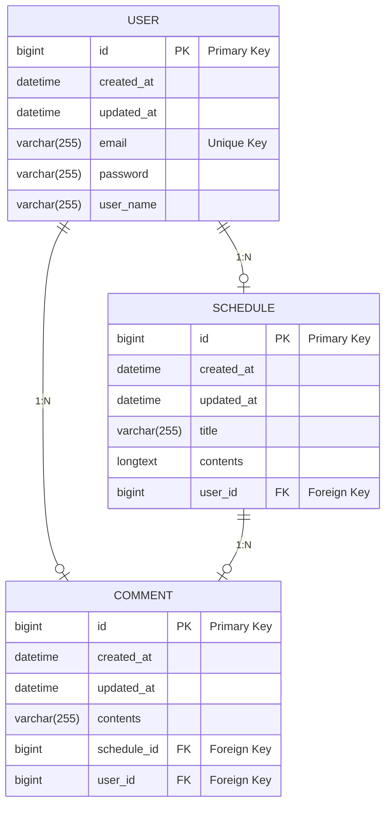

# Spring - JPA 프로젝트 SchedulerV2

## 🗒︎ Index
- 🎞️ 구조
  - API 명세
  -  [ERD](#erd)
  -  ✈️ [기능](#✈️-기능)
  -  - [유저](#유저-기능)
     - [일정](#일정-기능)
     - [댓글](#댓글-기능)
  -  ⚠️ [트러블 슈팅](#트러블-슈팅)
  -  😼 [후기](#후기)

## SchedulerV2 API 명세


## Class Diagram


## ERD



# ✈️ 기능
### 1. 화이트 리스트
> 일정,댓글 조회는 로그인 없이 이용가능 함.(GET방식일 경우는 WhiteList)  
> 로그인,회원가입 기능 역시 로그인 없이 이용 가능함.  
> 나머지는 로그인 후 세션에 로그인이 저장되어야 이용 가능함.   

<details>
  <summary>코드 보기</summary>
  
``` java

public class LoginFilter implements Filter {
    private static final String[] WHITE_LIST = {"/", "/users/register","/users/login","/schedules*","/comments*"};

    @Override
    public void doFilter(ServletRequest request, ServletResponse response, FilterChain chain) throws IOException,
            ServletException {
        HttpServletRequest httpRequest = (HttpServletRequest) request;
        HttpServletResponse httpResponse = (HttpServletResponse) response;

        String requestURI = httpRequest.getRequestURI();
        String method = httpRequest.getMethod();


        if (!isWhiteList(requestURI, method)) {
            HttpSession session = httpRequest.getSession(false);

            if (session == null || session.getAttribute("userEmail") == null) {
                httpResponse.setStatus(HttpStatus.UNAUTHORIZED.value());
                httpResponse.setContentType("application/json");
                httpResponse.getWriter().write("{\"error\": \"Log in is required.\"}");
                return;
            }
        }
        chain.doFilter(request, response);
    }

    private boolean isWhiteList(String requestURI, String method) {
        Boolean isScheduleNonGetRequest = requestURI.startsWith("/schedules") && !"GET".equals(method);
        Boolean isCommentNonGetRequest = requestURI.startsWith("/comments") && !"GET".equals(method);

        if (isScheduleNonGetRequest || isCommentNonGetRequest) {
            return false;
        }
        return PatternMatchUtils.simpleMatch(WHITE_LIST, requestURI);
    }
}

```
</details>

> 로그인 없이 화이트리스트에 없는 기능을 하려고하면 401에러처리 된다.


## 유저 기능
### 2. 유저 회원가입
> 일정 추가, 수정, 삭제 기능은 회원 전용 서비스 이기 때문에 회원가입이 필요함.  
 ---


> 이때 비밀번호는 암호화 되어 데이터베이스에 저장된다.  


### 3. 유저 로그인
> 화이트리스트에 없는 기능을 이용하려면 로그인이 필수다.  


### 4. 유저 정보 수정
> 로그인 필수. 파마리터에 유저고유식별자 id가 들어감. 

> 추후 파라미터에 id가 아닌 세션에서 가져오고, 이름과 비밀번호 수정으로 변경해야 함.  
  
### 5. 유저 삭제
> 해당 유저가 삭제되면, 해당 유저가 작성한 일정,댓글이 모두 삭제되어야함.
```java
Class User
  @OneToMany(mappedBy = "user", cascade = CascadeType.REMOVE, orphanRemoval = true)
    private List<Schedule> schedules = new ArrayList<>();

    @OneToMany(mappedBy = "user", cascade = CascadeType.REMOVE, orphanRemoval = true)
    private List<Comment> comments = new ArrayList<>();
```


> 삭제 기능 또한, 파라미터로 유저id를 받는것이 아닌 세션에서 유저객체를 가져와야 하고, 비밀번호 검증을 한번더 하면 좋을 듯 하다.

### 6. 유저 로그아웃 
> 로그인 된 상태에서 유저가 로그아웃을 하면, 세션에 저장된 유저 정보가 무효화됨.  
  

## 일정 기능

### 7. 일정 추가
> 로그인 필수, 사용자가 입력한 일정 정보와 세션에 있는 유저정보가 일정테이블에 저장된다.  


### 8. 일정 수정
> 로그인 필수, 일정의 아이디값을 PathVariable로 넣고 요청body에 수정할 제목과 내용을 넣어준다.  


### 9. 일정 삭제
> 로그인 필수, 일정의 아이디로 일정의 정보를 삭제함.


### 10. 일정 전체조회(필터링 및 페이징)
> 전체 이용가능 기능, 일정 제목,수정일로 필터링 하여 조회 할 수있으며, 페이지넘버와 사이즈로 페이징가능.  

>> 100개의 데이터중 1페이지,사이즈(디폴트 10) 아이디가11~20인 글들을 조회

### 11. 일정 단건 조회
> 전체 이용가능 기능, 일정id로 해당 일정의 데이터를 불러옴.


## 댓글 기능

### 12. 댓글 추가
> 로그인 필수, 요청 body에 일정id와 댓글 내용을 보내 댓글을 추가함.  


### 13. 댓글 전체 조회
> 전체 이용가능 기능. 요청값 없이 조회 가능


### 14. 댓글 단건 조회
> 전체 이용가능 기능, PathVarialbe로 댓글 id를 넘겨 해당 id의 댓글을 조회  


### 17. 댓글 수정
> 로그인 필수, PathVarialbe로 댓글 id를 넘겨 해당 id의 댓글을 수정


### 16. 댓글 삭제
> 로그인 필수, PathVarialbe로 댓글 id를 넘겨 해당 id의 댓글을 삭제  


# ⚠️ 트러블 슈팅
### 발생한 문제
> 유저삭제 시 유저가 작성한 일정이나, 댓글이 있으면 에러가 발생했다.  
>  o.h.engine.jdbc.spi.SqlExceptionHelper   : Cannot delete or update a parent row: a foreign key constraint fails (schedulerv2.comment, CONSTRAINT .....  

### 발생 원인
> 일정테이블과 댓글테이블에서 유저를 외래키로 받고있기 때문에 유저가 삭제되면 문제가 발생한다.  

### 해결방법
> 유저삭제 시 유저아이디를 외래키로 가지고있는 데이터도 함께 삭제 해야함.

```java
Class User
  @OneToMany(mappedBy = "user", cascade = CascadeType.REMOVE, orphanRemoval = true)
    private List<Schedule> schedules = new ArrayList<>();

    @OneToMany(mappedBy = "user", cascade = CascadeType.REMOVE, orphanRemoval = true)
    private List<Comment> comments = new ArrayList<>();
```


# 😼 후기
일단 JPA를 하면서 신세계를 경험했다..
repository에서 직접 메소드를 구현안해도 되고 무엇보다 sql을 직접 안써도 되는게 어메이징 했다..

또 필요한 부분에 대하여 직접 퀴리를 쓸 수도 있지만. 메소드명의 명명규칙에 따라 JPA가 쿼리를 자동으로 생성해서 날려준다는게 너무신기해따

> JPA는 메서드 명명규첵에 따라 쿼리를 자동생성함. 
[접두어] + By + [조건1] + [연산자] + [조건2] + ...
접두어: find, read, query, get, count, delete 등
By: 필수 키워드로 조건 시작을 알림
조건: 엔티티의 필드명을 사용 (카멜 케이스)
연산자: 필드에 적용되는 조건 (예: GreaterThan, Like 등)


그리고 이번에는 기능별로 DTO를 나눴다. 저번에는 엔티티별로 나눴지만 이번에는 기능별로 필요한값만 요청 받고 응답 할 수 있도록 DTO를 분리하였다.

또 테이블을 직접 생성하는것이 아니라 JPA로 Entity클래스에 설정해줘서 편하게 테이블을 만들고
연관관계도 설정할 수 있어서 좋았다!

그리고 Update쿼리에서도 Update메소드를 구현하거나 사용하는게 아닌
트렌젝션 안에서 Entity객체의 데이터가 변경되면 update를 호출할 필요없이
jpa데이터 수정됨을 감지 후 자동으로 쿼리를 날려주는것도 신기하고 편리했다.

``` java
@Override
    @Transactional
    public ScheduleResponseDto modifyScheduleById(Long id, ScheduleRequestDto dto) {
        Schedule schedule = scheduleRepository.findByIdOrElseThrow(id);
        schedule.UpdateTitleAndContents(dto);
        em.flush();//변경사항 즉시 반영
        return ScheduleResponseDto.toDto(schedule);
    }
```

#### 아직 구현 못한것과 리펙토링이 필요한부분
먼저 예외처리가 제대로 되어있지않다. 예를 들어 전체조회 시 빈 배열일 경우 NOT_FOUND로 한다던가.. 등등
또 게시글 수정 및 삭제 시 해당 게시글의 댓글이 같이 삭제되도록 구현해야한다.
(트러블 슈팅쓰면서 발견하게됨..)

어설픈 기능도 많다 유저 수정이나 삭제 시 세션에 있는 값을 이용해서 구현해야하는데
유저고유식별자를 입력받아 수정이나 삭제 되도록했다.
세션에 유저를 가져와 비밀번호 검증을 한번더 해서 수정을 하던지 삭제를 하던지~ 해야한다.

JPA를 학습하면서 새로운 기술(?)과 신세계를 많이 경험했다.
리펙토링을 거쳐서 좀더 완벽한 프로젝트가 되도록 해야게따

